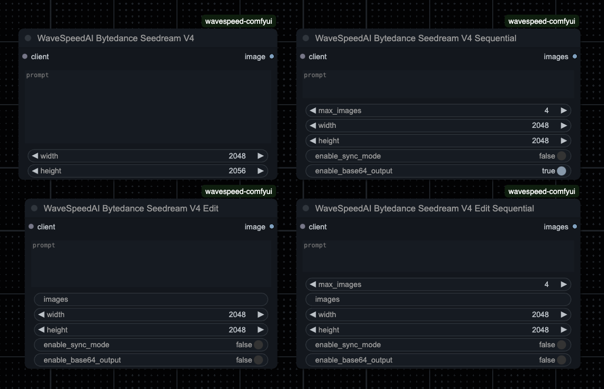
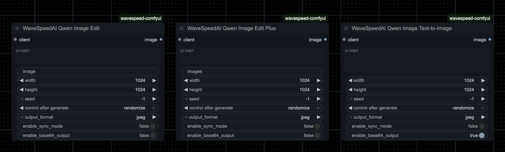

# WaveSpeed AI - ComfyUI Custom Nodes

**Version:** 2025.10.0 (CalVer)
**Category:** ERPK/WaveSpeedAI
**Namespace:** ERPK Organization Custom Nodes

Part of the [ERPK Custom Nodes Collection](../../README.md) for ComfyUI.

---

## ByteDance Seedream V4 Nodes


## Qwen Image Nodes


ComfyUI custom nodes for WaveSpeed AI integration, featuring ByteDance's Seedream V4 family of models and Qwen Image models for text-to-image generation and image editing.

## Features

### ByteDance Seedream V4 Models

| Node | Description | Dimensions | Input Images | Output | Pricing | API Docs |
|------|-------------|------------|--------------|--------|---------|----------|
| **Seedream V4** | Text-to-image generation | 0-4096px (step 8)<br>Default: 2048×2048 | N/A | Single image | Standard | [Link](https://wavespeed.ai/docs/docs-api/bytedance/bytedance-seedream-v4) |
| **Seedream V4 Sequential** | Multi-image generation with cross-image consistency | 1024-4096px (step 8)<br>Default: 2048×2048 | N/A | 1-15 images | $0.027/image | [Link](https://wavespeed.ai/docs/docs-api/bytedance/bytedance-seedream-v4-sequential) |
| **Seedream V4 Edit** | Image-to-image editing | 0-4096px (step 8) | Up to 10 | Single image | Standard | [Link](https://wavespeed.ai/docs/docs-api/bytedance/bytedance-seedream-v4-edit) |
| **Seedream V4 Edit Sequential** | Multi-image editing with coherent results | 1024-4096px (step 8) | Up to 10 (optional) | 1-15 images | $0.027/image | [Link](https://wavespeed.ai/docs/docs-api/bytedance/bytedance-seedream-v4-edit-sequential) |

### Qwen Image Models

| Node | Description | Dimensions | Input Images | Language | Output | Pricing | API Docs |
|------|-------------|------------|--------------|----------|--------|---------|----------|
| **Qwen Image Text-to-Image** | Bilingual text-to-image generation | 256-1536px (step 8)<br>Default: 1024×1024 | N/A | 🇨🇳 🇬🇧 | Single image<br>~5-8 sec | $0.02/image | [Link](https://wavespeed.ai/docs/docs-api/wavespeed-ai/qwen-image-text-to-image) |
| **Qwen Image Edit** | Low-level & high-level semantic editing | 256-1536px (step 8) | 1 required | 🇨🇳 🇬🇧 | Single image | $0.02/image | [Link](https://wavespeed.ai/docs/docs-api/wavespeed-ai/qwen-image-edit) |
| **Qwen Image Edit Plus** | Advanced multi-image context editing | 256-1536px (step 8) | Up to 3 required | 🇨🇳 🇬🇧 | Single image | $0.02/image | [Link](https://wavespeed.ai/docs/docs-api/wavespeed-ai/qwen-image-edit-plus) |

**Common Features (All Nodes):**
- Seed control for reproducibility
- Multiple output formats (jpeg, png, webp)
- Sync mode (wait for completion)
- Base64 output option

## Installation

### Prerequisites

**✅ Standalone Implementation:** This package is completely self-contained and does NOT require the official WaveSpeed AI ComfyUI nodes. All necessary API client functionality is included.

**🔧 Node Name Compatibility:** All custom nodes use unique prefixed names ("WaveSpeed Custom") to avoid conflicts with the official WaveSpeed ComfyUI nodes if both are installed.

### Manual Installation

1. Copy the entire `erpk` folder to your ComfyUI custom nodes directory:

```bash
# Navigate to your ComfyUI custom_nodes directory
cd /path/to/ComfyUI/custom_nodes/

# Copy the erpk folder (or clone if using git)
cp -r /path/to/this/repo/erpk ./
```

**Example installation path:**
```
/path/to/ComfyUI/custom_nodes/erpk/wavespeed/
```

2. Install the required dependencies:

```bash
cd erpk/wavespeed
pip install -r requirements.txt
```

The directory structure should look like:
```
ComfyUI/
  custom_nodes/
    erpk/
      wavespeed/
        __init__.py
        nodes.py
        requirements.txt
        config.ini (optional)
        seedream_v4.py
        seedream_v4_sequential.py
        seedream_v4_edit.py
        seedream_v4_edit_sequential.py
        qwen_image_text_to_image.py
        qwen_image_edit.py
        qwen_image_edit_plus.py
        wavespeed_api/
          __init__.py
          client.py
          utils.py
          requests/
            seedream_v4.py
            seedream_v4_sequential.py
            seedream_v4_edit.py
            seedream_v4_edit_sequential.py
            qwen_image_text_to_image.py
            qwen_image_edit.py
            qwen_image_edit_plus.py
```

### Requirements

- ComfyUI installation
- WaveSpeed AI API key
- Python dependencies:
  - `pydantic`
  - `requests` (or similar HTTP client)

## Usage

### Core Nodes (Required for all workflows)

#### WaveSpeedAI Client Node
1. Add the "WaveSpeedAI Client" node to your workflow
2. Enter your WaveSpeed AI API key (or leave empty to use config.ini)
3. Connect the client output to any WaveSpeed AI node

#### Upload Image Node
- Use to upload images to WaveSpeed AI for editing workflows
- Returns temporary URLs that expire after a short time

#### Preview/Save Nodes
- **Preview Video**: Download and preview generated videos
- **Save Audio**: Download and save generated audio files

### Bytedance Seedream V4 Node

1. Add the "WaveSpeedAI Bytedance Seedream V4" node to your workflow
2. Connect your WaveSpeed AI API client
3. Enter your text prompt
4. Configure width and height (optional)
5. Execute the workflow to generate images

### Bytedance Seedream V4 Edit Node

1. Add the "WaveSpeedAI Bytedance Seedream V4 Edit" node to your workflow
2. Connect your WaveSpeed AI API client
3. Provide reference images (up to 10)
4. Enter your editing prompt
5. Configure dimensions and options
6. Execute the workflow to edit images

### Bytedance Seedream V4 Sequential Node

1. Add the "WaveSpeedAI Bytedance Seedream V4 Sequential" node to your workflow
2. Connect your WaveSpeed AI API client
3. Enter your text prompt (e.g., "a sunset over mountains")
4. Set `max_images` to the number of images you want (1-15)
5. Configure dimensions and options (optional)
6. Execute the workflow to generate multiple coherent images

**Note:** The node automatically appends "Generate a set of {max_images} consecutive." to your prompt to ensure API compliance.

### Bytedance Seedream V4 Edit Sequential Node

1. Add the "WaveSpeedAI Bytedance Seedream V4 Edit Sequential" node to your workflow
2. Connect your WaveSpeed AI API client
3. Enter your editing prompt (e.g., "make the sky more vibrant")
4. Set `max_images` to the number of images you want (1-15)
5. Optionally provide reference images (up to 10)
6. Configure dimensions and options (optional)
7. Execute the workflow to generate multiple coherent edited images

**Note:** The node automatically appends "Generate a set of {max_images} consecutive." to your prompt to ensure API compliance.

### Qwen Image Text-to-Image Node

1. Add the "WaveSpeedAI Qwen Image Text-to-Image" node to your workflow
2. Connect your WaveSpeed AI API client
3. Enter your text prompt (supports Chinese and English)
4. Configure dimensions (optional, default 1024x1024)
5. Set seed, output format, and other options (optional)
6. Execute the workflow to generate images

### Qwen Image Edit Node

1. Add the "WaveSpeedAI Qwen Image Edit" node to your workflow
2. Connect your WaveSpeed AI API client
3. Provide a single image to edit (URL or path)
4. Enter your editing prompt (supports Chinese and English)
5. Configure dimensions and options (optional)
6. Execute the workflow to edit the image

### Qwen Image Edit Plus Node

1. Add the "WaveSpeedAI Qwen Image Edit Plus" node to your workflow
2. Connect your WaveSpeed AI API client
3. Provide up to 3 reference images (comma-separated URLs or paths)
4. Enter your editing prompt (supports Chinese and English)
5. Configure dimensions and options (optional)
6. Execute the workflow to generate edited images

## API Configuration

You'll need a WaveSpeed AI API key to use these nodes. There are three ways to provide your API key, checked in this priority order:

### 1. Direct Node Input (Highest Priority)
Enter your API key directly in the WaveSpeedAI Client node's `api_key` field.

### 2. Environment Variable
Set the `WAVESPEED_API_KEY` environment variable:

```bash
# On Linux/macOS
export WAVESPEED_API_KEY="your-api-key-here"

# On Windows (PowerShell)
$env:WAVESPEED_API_KEY="your-api-key-here"

# On Windows (Command Prompt)
set WAVESPEED_API_KEY=your-api-key-here
```

Then restart ComfyUI to load the environment variable.

### 3. Config File (Lowest Priority)
Create or edit `config.ini` in the wavespeed folder:

```ini
[API]
WAVESPEED_API_KEY = your-api-key-here
```

**Note:** The API client will try each method in order until it finds a valid key. This allows you to use environment variables for development and production deployments while still supporting direct input for testing.

For detailed API reference and parameters:
- [Bytedance Seedream V4 API Documentation](https://wavespeed.ai/docs/docs-api/bytedance/bytedance-seedream-v4)
- [Bytedance Seedream V4 Sequential API Documentation](https://wavespeed.ai/docs/docs-api/bytedance/bytedance-seedream-v4-sequential)
- [Bytedance Seedream V4 Edit API Documentation](https://wavespeed.ai/docs/docs-api/bytedance/bytedance-seedream-v4-edit)
- [Bytedance Seedream V4 Edit Sequential API Documentation](https://wavespeed.ai/docs/docs-api/bytedance/bytedance-seedream-v4-edit-sequential)
- [Qwen Image Text-to-Image API Documentation](https://wavespeed.ai/docs/docs-api/wavespeed-ai/qwen-image-text-to-image)
- [Qwen Image Edit API Documentation](https://wavespeed.ai/docs/docs-api/wavespeed-ai/qwen-image-edit)
- [Qwen Image Edit Plus API Documentation](https://wavespeed.ai/docs/docs-api/wavespeed-ai/qwen-image-edit-plus)

## Troubleshooting

### Nodes Not Appearing in ComfyUI

If the WaveSpeed nodes don't appear in ComfyUI after installation:

1. **Verify Installation Path**: Ensure the erpk folder is directly inside `ComfyUI/custom_nodes/` and contains the wavespeed folder

2. **Check Python Dependencies**: Install all required packages:
```bash
cd ComfyUI/custom_nodes/erpk/wavespeed
pip install -r requirements.txt
```

3. **Restart ComfyUI**: Completely restart ComfyUI after installation

4. **Check Console for Errors**: Look for any error messages in the ComfyUI console when it starts

5. **Verify Import**: Test if the module imports correctly:
```python
# Run this from ComfyUI directory
python -c "import sys; sys.path.insert(0, 'custom_nodes'); from erpk import wavespeed; print('Loaded', len(wavespeed.NODE_CLASS_MAPPINGS), 'nodes')"
```

You should see: `Loaded 11 nodes`

### Common Issues

- **"No module named 'pydantic'"**: Install requirements with `pip install pydantic requests pillow`
- **Nodes load but don't work**: Ensure you have a valid WaveSpeed API key
- **Import errors**: Make sure you're using the correct directory structure as shown above

## Finding Nodes in ComfyUI

All WaveSpeed nodes are located under the **ERPK/WaveSpeedAI** category:

1. Right-click on the ComfyUI canvas
2. Select "Add Node"
3. Navigate to: **ERPK → WaveSpeedAI**
4. Select your desired node

**Available nodes:**
- WaveSpeed Client (Custom)
- WaveSpeed Preview Video (Custom)
- WaveSpeed Save Audio (Custom)
- WaveSpeed Upload Image (Custom)
- Bytedance Seedream V4 (Custom)
- Bytedance Seedream V4 Sequential (Custom)
- Bytedance Seedream V4 Edit (Custom)
- Bytedance Seedream V4 Edit Sequential (Custom)
- Qwen Image Text-to-Image (Custom)
- Qwen Image Edit (Custom)
- Qwen Image Edit Plus (Custom)

## Versioning

This package follows **Calendar Versioning (CalVer)**: `YYYY.MM.PATCH`

**Current Version:** 2025.10.0

- Major changes are released monthly
- Patch releases for bug fixes within the month
- Breaking changes will be clearly documented in release notes

### Version History

#### 2025.10.0 (Current - October 2025)
- ✨ Restructured to ERPK namespace
- ✨ Changed category from "WaveSpeed Custom" to "ERPK/WaveSpeedAI"
- ✨ Adopted Calendar Versioning (CalVer)
- ✨ All nodes now use standardized ERPK organization structure
- ✨ Improved installation process with ERPK folder structure
- 📝 Updated documentation with comprehensive installation guide

## License

MIT License

## Support

For issues and questions, please refer to the WaveSpeed AI documentation or create an issue in this repository.
