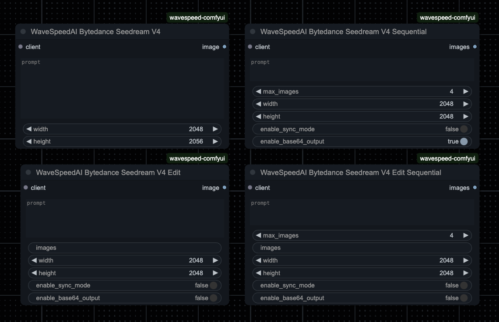
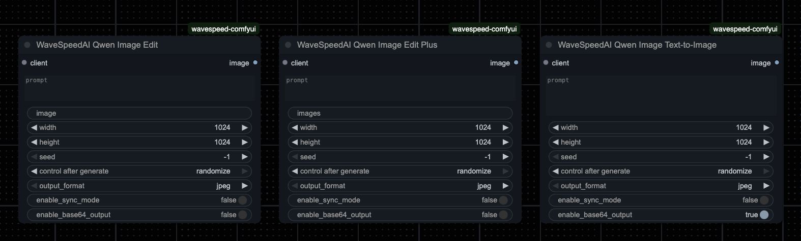

# WaveSpeed AI - ComfyUI Custom Nodes

**Version:** 2026.2.19 (CalVer)
**Category:** ERPK/WaveSpeedAI
**Namespace:** ERPK Organization Custom Nodes

Part of the [ERPK Custom Nodes Collection](../../README.md) for ComfyUI.

---

## ByteDance Seedream V4 Nodes


## Qwen Image Nodes


ComfyUI custom nodes for WaveSpeed AI integration, featuring ByteDance's Seedream V4 family of models and Qwen Image models for text-to-image generation and image editing.

## Features

### ByteDance Seedream V4 Models

| Node | Description | Dimensions | Input Images | Output | Pricing | API Docs |
|------|-------------|------------|--------------|--------|---------|----------|
| **Seedream V4** | Text-to-image generation | 320-4096px (step 8)<br>Default: 1408×1408 | N/A | Single image | Standard | [Link](https://wavespeed.ai/docs/docs-api/bytedance/bytedance-seedream-v4) |
| **Seedream V4 Sequential** | Multi-image generation with cross-image consistency | 320-4096px (step 8)<br>Default: 1408×1408 | N/A | 1-15 images | $0.027/image | [Link](https://wavespeed.ai/docs/docs-api/bytedance/bytedance-seedream-v4-sequential) |
| **Seedream V4 Edit** | Image-to-image editing | 320-4096px (step 8) | Up to 10 | Single image | Standard | [Link](https://wavespeed.ai/docs/docs-api/bytedance/bytedance-seedream-v4-edit) |
| **Seedream V4 Edit Sequential** | Multi-image editing with coherent results | 320-4096px (step 8) | Up to 10 (optional) | 1-15 images | $0.027/image | [Link](https://wavespeed.ai/docs/docs-api/bytedance/bytedance-seedream-v4-edit-sequential) |

### ByteDance Seedream V4.5 Models

Enhanced typography and text rendering for posters, logos, UI, and marketing layouts.

| Node | Description | Dimensions | Input Images | Output | Pricing | API Docs |
|------|-------------|------------|--------------|--------|---------|----------|
| **Seedream V4.5** | Text-to-image with enhanced typography | 1024-4096px (step 8)<br>Default: 2048×2048 | N/A | Single image | Standard | [Link](https://wavespeed.ai/docs/docs-api/bytedance/bytedance-seedream-v4-5) |
| **Seedream V4.5 Sequential** | Multi-image generation with typography | 1024-4096px (step 8)<br>Default: 2048×2048 | N/A | 1-15 images | $0.027/image | [Link](https://wavespeed.ai/docs/docs-api/bytedance/bytedance-seedream-v4-5-sequential) |
| **Seedream V4.5 Edit** | Image editing with enhanced typography | 1024-4096px (step 8) | Up to 10 | Single image | Standard | [Link](https://wavespeed.ai/docs/docs-api/bytedance/bytedance-seedream-v4-5-edit) |
| **Seedream V4.5 Edit Sequential** | Multi-image editing with typography | 1024-4096px (step 8) | Up to 10 (optional) | 1-15 images | $0.027/image | [Link](https://wavespeed.ai/docs/docs-api/bytedance/bytedance-seedream-v4-5-edit-sequential) |

### Qwen Image Models

| Node | Models | Description | Dimensions | Input Images | Language | Output | Pricing | API Docs |
|------|--------|-------------|------------|--------------|----------|--------|---------|----------|
| **Qwen Image Text-to-Image** | Qwen Image (20B MMDiT),<br>Qwen Image 2512 (7B) | Bilingual text-to-image generation | 256-1536px (step 8)<br>Default: 1024×1024 | N/A | 🇨🇳 🇬🇧 | Single image<br>~5-8 sec | $0.02/image | [Link](https://wavespeed.ai/docs/docs-api/wavespeed-ai/qwen-image-text-to-image) |
| **Qwen Image Edit** | Qwen Edit | Low-level & high-level semantic editing | 256-1536px (step 8) | 1 required | 🇨🇳 🇬🇧 | Single image | $0.02/image | [Link](https://wavespeed.ai/docs/docs-api/wavespeed-ai/qwen-image-edit) |
| **Qwen Image Edit Plus** | Qwen Edit Plus,<br>Qwen Edit 2511 | Advanced multi-image context editing | 256-1536px (step 8) | Up to 3 required | 🇨🇳 🇬🇧 | Single image | $0.02/image | [Link](https://wavespeed.ai/docs/docs-api/wavespeed-ai/qwen-image-edit-plus) |
| **Qwen Image Multiple Angles** | Qwen Edit 2509 | Angle-based image transformation | 256-1536px (step 8)<br>Default: 1024×1024 | 1-3 required | 🇨🇳 🇬🇧 | Single image | $0.02/image | [Link](https://wavespeed.ai/docs/docs-api/wavespeed-ai/qwen-image-edit-2509-multiple-angles) |
| **Qwen Image LoRA** | Qwen Image,<br>Qwen Image 2512 | Text-to-image with LoRA model influences | 256-1536px (step 8)<br>Default: 1024×1024 | N/A | 🇨🇳 🇬🇧 | Single image | $0.02/image | [Link](https://wavespeed.ai/docs/docs-api/wavespeed-ai/qwen-image-text-to-image-lora) |
| **Qwen Image Edit LoRA** | Qwen Edit LoRA | Single-image editing with LoRA influences | 256-1536px (step 8)<br>Default: 1024×1024 | 1 required | 🇨🇳 🇬🇧 | Single image | $0.02/image | [Link](https://wavespeed.ai/docs/docs-api/wavespeed-ai/qwen-image-edit-lora) |
| **Qwen Image Edit Plus LoRA** | Qwen Edit Plus LoRA,<br>Qwen Edit 2511 LoRA | Multi-image editing with LoRA influences | 256-1536px (step 8)<br>Default: 1024×1024 | Up to 3 required | 🇨🇳 🇬🇧 | Single image | $0.02/image | [Link](https://wavespeed.ai/docs/docs-api/wavespeed-ai/qwen-image-edit-plus-lora) |
| **Qwen Image Layered** | Qwen Layered | Image decomposition into RGBA layers | N/A | 1 required | 🇨🇳 🇬🇧 | 2-8 RGBA layers | $0.025/layer | [Link](https://wavespeed.ai/docs/docs-api/wavespeed-ai/qwen-image-layered) |

**Common Features (All Seedream Nodes):**
- Size preset dropdown with recommended resolutions
- Custom width/height with auto-sync from presets
- Aspect ratio display in node title (toggleable)
- Sync mode (wait for completion)
- Base64 output option

**Common Features (All Qwen Nodes):**
- Model variant selector (where applicable) for choosing between model versions
- Seed control for reproducibility
- Multiple output formats (jpeg, png, webp)
- Sync mode (wait for completion)
- Base64 output option

## Installation

### Prerequisites

**✅ Standalone Implementation:** This package is completely self-contained and does NOT require the official WaveSpeed AI ComfyUI nodes. All necessary API client functionality is included.

**🔧 Node Name Compatibility:** All custom nodes use unique node IDs to avoid conflicts with the official WaveSpeed ComfyUI nodes if both are installed.

### Manual Installation

1. Clone the repository to your ComfyUI custom nodes directory:

```bash
# Navigate to your ComfyUI custom_nodes directory
cd /path/to/ComfyUI/custom_nodes/

# Clone the repository as 'erpk'
git clone https://github.com/eRepublik-Labs/comfyui-nodes-erpk.git erpk
```

**Example installation path:**
```
/path/to/ComfyUI/custom_nodes/erpk/wavespeed/
```

2. Install the required dependencies:

```bash
cd erpk
pip install -r wavespeed/requirements.txt
```

The directory structure should look like:
```
ComfyUI/
  custom_nodes/
    erpk/
      wavespeed/
        __init__.py
        nodes.py
        requirements.txt
        config.ini (optional)
        seedream_v4.py
        seedream_v4_sequential.py
        seedream_v4_edit.py
        seedream_v4_edit_sequential.py
        seedream_v4_5.py
        seedream_v4_5_sequential.py
        seedream_v4_5_edit.py
        seedream_v4_5_edit_sequential.py
        qwen_image_text_to_image.py
        qwen_image_edit.py
        qwen_image_edit_plus.py
        qwen_image_multiple_angles.py
        qwen_image_lora.py
        qwen_image_edit_lora.py
        qwen_image_edit_plus_lora.py
        qwen_image_layered.py
        wavespeed_api/
          __init__.py
          client.py
          utils.py
          requests/
            seedream_v4.py
            seedream_v4_sequential.py
            seedream_v4_edit.py
            seedream_v4_edit_sequential.py
            seedream_v4_5.py
            seedream_v4_5_sequential.py
            seedream_v4_5_edit.py
            seedream_v4_5_edit_sequential.py
            qwen_image_text_to_image.py
            qwen_image_text_to_image_2512.py
            qwen_image_edit.py
            qwen_image_edit_plus.py
            qwen_image_edit_2511.py
            qwen_image_multiple_angles.py
            qwen_image_lora.py
            qwen_image_edit_lora.py
            qwen_image_edit_plus_lora.py
            qwen_image_edit_2511_lora.py
            qwen_image_text_to_image_2512_lora.py
            qwen_image_layered.py
      web/
        aspect_ratio.js
```

### Requirements

- ComfyUI installation
- WaveSpeed AI API key
- Python dependencies:
  - `pydantic`
  - `requests` (or similar HTTP client)

## Usage

### Core Nodes

#### WaveSpeedAI Client Node
Optional if API key is configured via ComfyUI Settings, environment variable, or config.ini — WaveSpeed model nodes can run standalone.

1. Add the "WaveSpeedAI Client" node to your workflow
2. Enter your WaveSpeed AI API key (or leave empty to use Settings/env/config.ini)
3. Connect the client output to any WaveSpeed AI node

#### Upload Image Node
- Use to upload images to WaveSpeed AI for editing workflows
- Returns temporary URLs that expire after a short time

#### Preview/Save Nodes
- **Preview Video**: Download and preview generated videos
- **Save Audio**: Download and save generated audio files

### Bytedance Seedream V4 Node

1. Add the "WaveSpeedAI Bytedance Seedream V4" node to your workflow
2. Connect your WaveSpeed AI API client
3. Enter your text prompt
4. Configure width and height (optional)
5. Execute the workflow to generate images

### Bytedance Seedream V4 Edit Node

1. Add the "WaveSpeedAI Bytedance Seedream V4 Edit" node to your workflow
2. Connect your WaveSpeed AI API client
3. Provide reference images (up to 10)
4. Enter your editing prompt
5. Configure dimensions and options
6. Execute the workflow to edit images

### Bytedance Seedream V4 Sequential Node

1. Add the "WaveSpeedAI Bytedance Seedream V4 Sequential" node to your workflow
2. Connect your WaveSpeed AI API client
3. Enter your text prompt (e.g., "a sunset over mountains")
4. Set `max_images` to the number of images you want (1-15)
5. Configure dimensions and options (optional)
6. Execute the workflow to generate multiple coherent images

**Note:** The node automatically appends "Generate a set of {max_images} consecutive." to your prompt to ensure API compliance.

### Bytedance Seedream V4 Edit Sequential Node

1. Add the "WaveSpeedAI Bytedance Seedream V4 Edit Sequential" node to your workflow
2. Connect your WaveSpeed AI API client
3. Enter your editing prompt (e.g., "make the sky more vibrant")
4. Set `max_images` to the number of images you want (1-15)
5. Optionally provide reference images (up to 10)
6. Configure dimensions and options (optional)
7. Execute the workflow to generate multiple coherent edited images

**Note:** The node automatically appends "Generate a set of {max_images} consecutive." to your prompt to ensure API compliance.

### Qwen Image Text-to-Image Node

1. Add the "WaveSpeedAI Qwen Image Text-to-Image" node to your workflow
2. Select the model variant: **Qwen Image** (20B MMDiT) or **Qwen Image 2512** (7B, better text rendering)
3. Connect your WaveSpeed AI API client
4. Enter your text prompt (supports Chinese and English)
5. Configure dimensions (optional, default 1024x1024)
6. Set seed, output format, and other options (optional)
7. Execute the workflow to generate images

### Qwen Image Edit Node

1. Add the "WaveSpeedAI Qwen Image Edit" node to your workflow
2. Connect your WaveSpeed AI API client
3. Provide a single image to edit (URL or path)
4. Enter your editing prompt (supports Chinese and English)
5. Configure dimensions and options (optional)
6. Execute the workflow to edit the image

### Qwen Image Edit Plus Node

1. Add the "WaveSpeedAI Qwen Image Edit Plus" node to your workflow
2. Select the model variant: **Qwen Edit Plus** or **Qwen Edit 2511** (multi-person editing, improved consistency)
3. Connect your WaveSpeed AI API client
4. Provide up to 3 reference images (comma-separated URLs or paths)
5. Enter your editing prompt (supports Chinese and English)
6. Configure dimensions and options (optional)
7. Execute the workflow to generate edited images

### Qwen Image Multiple Angles Node

1. Add the "WaveSpeedAI Qwen Image Multiple Angles" node to your workflow
2. Connect your WaveSpeed AI API client
3. Provide 1-3 reference images (comma-separated URLs or paths)
4. Adjust angle parameters: horizontal (-90 to 90), vertical (-30 to 60), distance (0 to 2)
5. Optionally enter a text prompt to guide the transformation
6. Configure dimensions and options (optional)
7. Execute the workflow to generate angle-adjusted images

### Qwen Image LoRA Node

1. Add the "WaveSpeedAI Qwen Image LoRA" node to your workflow
2. Select the model variant: **Qwen Image** (20B MMDiT) or **Qwen Image 2512** (7B, better text rendering)
3. Connect your WaveSpeed AI API client
4. Enter your text prompt (supports Chinese and English)
5. Provide the URL to your first LoRA model file and set its scale (0.0 to 4.0)
6. Optionally add up to 2 more LoRA models with individual scale settings
7. Configure dimensions and options (optional)
8. Execute the workflow to generate LoRA-guided images

### Qwen Image Edit LoRA Node

1. Add the "WaveSpeedAI Qwen Image Edit LoRA" node to your workflow
2. Connect your WaveSpeed AI API client
3. Provide a single image to edit (URL or path)
4. Enter your editing prompt (supports Chinese and English)
5. Provide the URL to your first LoRA model file and set its scale (0.0 to 4.0)
6. Optionally add up to 2 more LoRA models with individual scale settings
7. Configure dimensions and options (optional)
8. Execute the workflow to generate LoRA-guided edited images

### Qwen Image Edit Plus LoRA Node

1. Add the "WaveSpeedAI Qwen Image Edit Plus LoRA" node to your workflow
2. Select the model variant: **Qwen Edit Plus LoRA** or **Qwen Edit 2511 LoRA** (multi-person editing, improved consistency)
3. Connect your WaveSpeed AI API client
4. Provide up to 3 reference images (comma-separated URLs or paths)
5. Enter your editing prompt (supports Chinese and English)
6. Provide the URL to your first LoRA model file and set its scale (0.0 to 4.0)
7. Optionally add up to 2 more LoRA models with individual scale settings
8. Configure dimensions and options (optional)
9. Execute the workflow to generate LoRA-guided edited images

### Qwen Image Layered Node

1. Add the "WaveSpeedAI Qwen Image Layered" node to your workflow
2. Connect your WaveSpeed AI API client
3. Provide the image to decompose (URL or path)
4. Set the number of layers (2-8, default 4)
5. Optionally enter a prompt to guide layer decomposition
6. Execute the workflow to receive RGB image layers and their alpha masks

## API Configuration

You'll need a WaveSpeed AI API key to use these nodes. There are four ways to provide your API key, checked in this priority order (Settings highest, config.ini lowest):

### 1. ComfyUI Settings (Recommended, Highest Priority)
Go to **Settings > ERPK > API Keys** (or right-click canvas > **ERPK Settings**) and enter your WaveSpeed AI API key.
Keys configured here are stored in your user settings, not in workflows, so they won't leak when sharing.
In multi-user installations, each user's keys are resolved separately.

### 2. Direct Node Input
Enter your API key directly in the WaveSpeedAI Client node's `api_key` field.

### 3. Environment Variable
Set the `WAVESPEED_API_KEY` environment variable:

```bash
# On Linux/macOS
export WAVESPEED_API_KEY="your-api-key-here"

# On Windows (PowerShell)
$env:WAVESPEED_API_KEY="your-api-key-here"

# On Windows (Command Prompt)
set WAVESPEED_API_KEY=your-api-key-here
```

Then restart ComfyUI to load the environment variable.

### 4. Config File (Lowest Priority)
Create or edit `config.ini` in the wavespeed folder:

```ini
[API]
WAVESPEED_API_KEY = your-api-key-here
```

**Note:** The API client will try each method in order until it finds a valid key. This allows you to use environment variables for development and production deployments while still supporting direct input for testing.

For detailed API reference and parameters:
- [Bytedance Seedream V4 API Documentation](https://wavespeed.ai/docs/docs-api/bytedance/bytedance-seedream-v4)
- [Bytedance Seedream V4 Sequential API Documentation](https://wavespeed.ai/docs/docs-api/bytedance/bytedance-seedream-v4-sequential)
- [Bytedance Seedream V4 Edit API Documentation](https://wavespeed.ai/docs/docs-api/bytedance/bytedance-seedream-v4-edit)
- [Bytedance Seedream V4 Edit Sequential API Documentation](https://wavespeed.ai/docs/docs-api/bytedance/bytedance-seedream-v4-edit-sequential)
- [Qwen Image Text-to-Image API Documentation](https://wavespeed.ai/docs/docs-api/wavespeed-ai/qwen-image-text-to-image)
- [Qwen Image Text-to-Image 2512 API Documentation](https://wavespeed.ai/docs/docs-api/wavespeed-ai/qwen-image-text-to-image-2512)
- [Qwen Image Edit API Documentation](https://wavespeed.ai/docs/docs-api/wavespeed-ai/qwen-image-edit)
- [Qwen Image Edit Plus API Documentation](https://wavespeed.ai/docs/docs-api/wavespeed-ai/qwen-image-edit-plus)
- [Qwen Image Edit 2511 API Documentation](https://wavespeed.ai/docs/docs-api/wavespeed-ai/qwen-image-edit-2511)
- [Qwen Image Multiple Angles API Documentation](https://wavespeed.ai/docs/docs-api/wavespeed-ai/qwen-image-edit-2509-multiple-angles)
- [Qwen Image LoRA API Documentation](https://wavespeed.ai/docs/docs-api/wavespeed-ai/qwen-image-text-to-image-lora)
- [Qwen Image Text-to-Image 2512 LoRA API Documentation](https://wavespeed.ai/docs/docs-api/wavespeed-ai/qwen-image-text-to-image-2512-lora)
- [Qwen Image Edit LoRA API Documentation](https://wavespeed.ai/docs/docs-api/wavespeed-ai/qwen-image-edit-lora)
- [Qwen Image Edit Plus LoRA API Documentation](https://wavespeed.ai/docs/docs-api/wavespeed-ai/qwen-image-edit-plus-lora)
- [Qwen Image Edit 2511 LoRA API Documentation](https://wavespeed.ai/docs/docs-api/wavespeed-ai/qwen-image-edit-2511-lora)
- [Qwen Image Layered API Documentation](https://wavespeed.ai/docs/docs-api/wavespeed-ai/qwen-image-layered)

## Troubleshooting

### Nodes Not Appearing in ComfyUI

If the WaveSpeed nodes don't appear in ComfyUI after installation:

1. **Verify Installation Path**: Ensure the erpk folder is directly inside `ComfyUI/custom_nodes/` and contains the wavespeed folder

2. **Check Python Dependencies**: Install all required packages:
```bash
cd ComfyUI/custom_nodes/erpk/wavespeed
pip install -r requirements.txt
```

3. **Restart ComfyUI**: Completely restart ComfyUI after installation

4. **Check Console for Errors**: Look for any error messages in the ComfyUI console when it starts

5. **Verify Import**: Check the ComfyUI console output on startup for:
```
[ERPK] Loaded 20 V3 nodes
```

### Common Issues

- **"No module named 'pydantic'"**: Install requirements with `pip install pydantic requests pillow`
- **Nodes load but don't work**: Ensure you have a valid WaveSpeed API key
- **Import errors**: Make sure you're using the correct directory structure as shown above

## Finding Nodes in ComfyUI

All WaveSpeed nodes are located under the **ERPK/WaveSpeedAI** category:

1. Right-click on the ComfyUI canvas
2. Select "Add Node"
3. Navigate to: **ERPK → WaveSpeedAI**
4. Select your desired node

**Available nodes (20 total):**
- WaveSpeed Client
- WaveSpeed Preview Video
- WaveSpeed Save Audio
- WaveSpeed Upload Image
- Bytedance Seedream V4
- Bytedance Seedream V4 Sequential
- Bytedance Seedream V4 Edit
- Bytedance Seedream V4 Edit Sequential
- Bytedance Seedream V4.5
- Bytedance Seedream V4.5 Sequential
- Bytedance Seedream V4.5 Edit
- Bytedance Seedream V4.5 Edit Sequential
- Qwen Image Text-to-Image
- Qwen Image Edit
- Qwen Image Edit Plus
- Qwen Image Multiple Angles
- Qwen Image LoRA
- Qwen Image Edit LoRA
- Qwen Image Edit Plus LoRA
- Qwen Image Layered

## Versioning

This package follows **Calendar Versioning (CalVer)**: `YYYY.MM.PATCH`

**Current Version:** 2026.2.19

- Major changes are released monthly
- Patch releases for bug fixes within the month
- Breaking changes will be clearly documented in release notes

### Version History

#### 2025.10.0 (Current - October 2025)
- ✨ Restructured to ERPK namespace
- ✨ Changed category from "WaveSpeed Custom" to "ERPK/WaveSpeedAI"
- ✨ Adopted Calendar Versioning (CalVer)
- ✨ All nodes now use standardized ERPK organization structure
- ✨ Improved installation process with ERPK folder structure
- 📝 Updated documentation with comprehensive installation guide

## License

MIT License

## Support

For issues and questions, please refer to the WaveSpeed AI documentation or create an issue in this repository.
